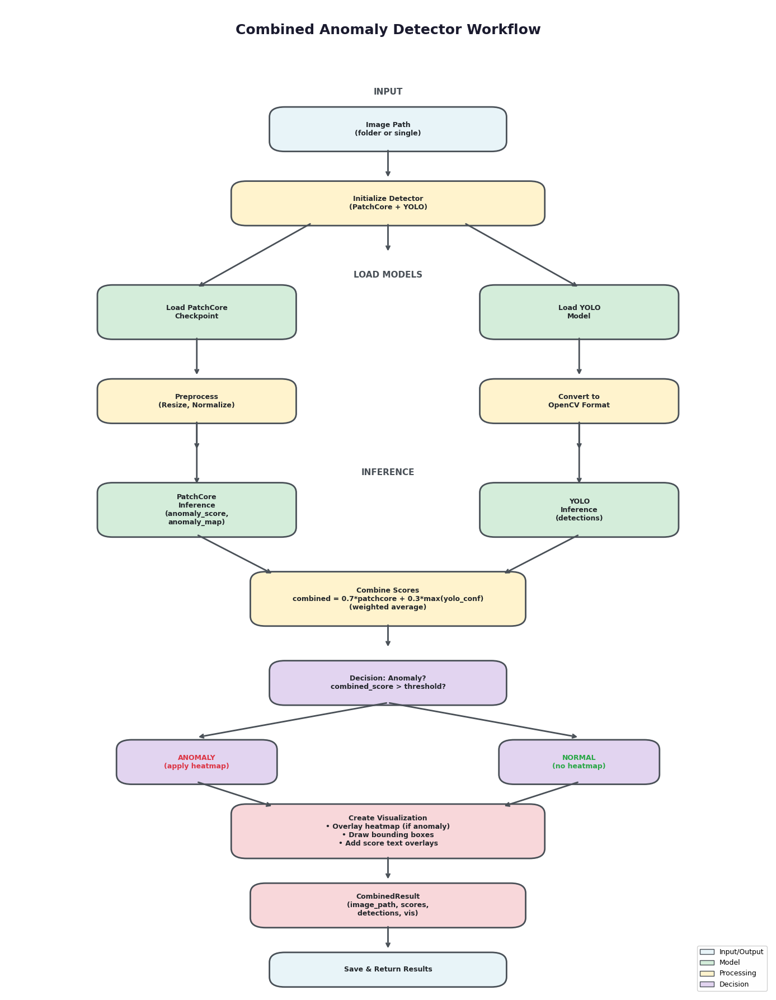
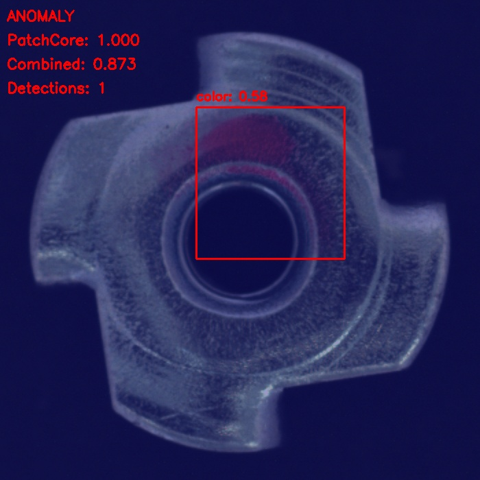
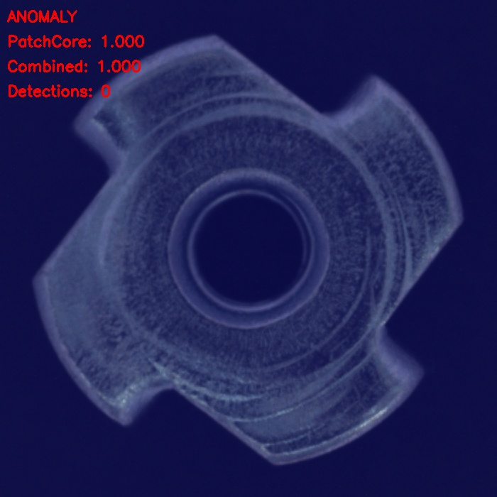
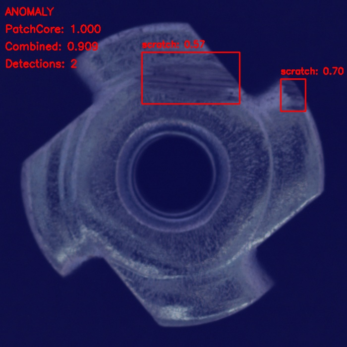

#  Anomaly Detection on Metal Nut

 Detect anomalies using **PatchCore** and classify defects using **YOLO**, with GPU acceleration (CUDA).

---

##  GPU Acceleration (CUDA)

 Hardware / GPU (CUDA)

- GPU: NVIDIA RTX 5060 (8GB)
- CUDA Version: 13.2
- cuDNN Version: 9.19
- Framework: PyTorch
```python
import torch
device = torch.device("cuda" if torch.cuda.is_available() else "cpu")
print("Using device:", device)
```

---
##  Workflow



---

##  Methodology

1. **PatchCore**

   * Computes anomaly score
   * Generates anomaly map
   * Detects whether image is normal or anomalous

2. **YOLO**

   * Runs only on anomalous images
   * Detects defect type (scratch, dent, etc.)

3. **Score Fusion**

   * Combined score =
     `0.7 * PatchCore + 0.3 * YOLO confidence`

4. **Final Output**

   * is_anomaly (True/False)
   * defect_type
   * anomaly score
   * visualization

---


## Results

### Sample Outputs
##  Results






## Output Example

* is_anomaly: True / False
* defect_type: scratch / dent / unknown
* patchcore_score
* combined_score

---

